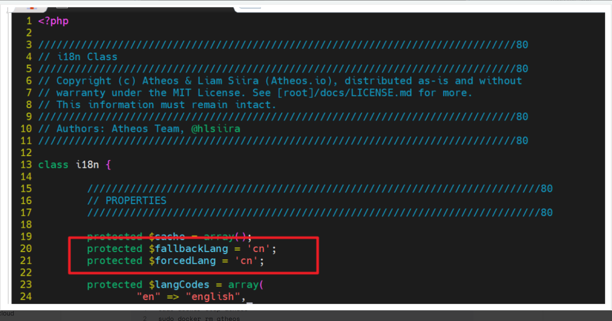

# Atheos

Atheos 是 Codiad 的一个更新且当前维护的分支，Codiad 是一个基于 Web 的 IDE 框架，占用空间小且要求最低。

Codiad 的构建考虑到了简单性，允许快速、交互式开发，而无需某些大型桌面编辑器的大量开销。话虽如此，即使是 Eclipse、NetBeans 和 Aptana 等 IDE 的用户也发现 Codiad 的简单性带来了巨大的好处。虽然简单性是关键，但我们并没有吝惜功能，并且有一个专门的开发团队积极添加更多功能。

Atheos 正在尽可能地扩展这种理念，试图进一步最小化其占用空间，同时最大化功能和性能。Atheos 的主要目标是从下到上彻底重写每一行代码，包括插件；原因是 Codiad 是经过很长一段时间构建的，并且较旧的文件仍然使用更旧的标准。Codiad 积累了大量技术债务需要解决。

有关该项目的更多信息，请查看[**文档**](https://www.atheos.io/docs)或[**Atheos 网站**](http://www.atheos.io/)

# Docker 部署

## 创建容器-默认

```bash
sudo docker stop atheos
sudo docker rm atheos

sudo docker run -d \
--restart unless-stopped \
--name atheos \
-p 33016:80 \
-e TZ=Asia/Shanghai \
hlsiira/atheos:latest
```

> 不要打开浏览器去登陆，直接进行下一步

## 挂载镜像并修改配置

```bash
## 拷贝镜像资源到宿主机
sudo docker cp  atheos:/var/www/html /home/xpcheng/docker-data/atheos
## 创建空配置文件
touch /home/xpcheng/docker-data/atheos/config.php
```

```bash
## 修改为默认中文语言
sudo vim /home/xpcheng/docker-data/atheos/traits/i18n.php
```

修改下图中的行



替换中文映射文件/home/xpcheng/docker-data/atheos/languages/cn.json 为 [Atheos中文配置映射](application/atheos_lang_cn_map.md)

```bash
sudo rm -rf /home/xpcheng/docker-data/atheos/languages/cn.json
sudo vim /home/xpcheng/docker-data/atheos/languages/cn.json
```

## 重建容器

```bash
sudo docker stop atheos
sudo docker rm atheos

sudo docker run -d \
--restart unless-stopped \
--name atheos \
-p 33016:80 \
-e TZ=Asia/Shanghai \
-v /home/xpcheng/docker-data/atheos:/var/www/html \
hlsiira/atheos:latest
```

# 扩展能力

您可以轻松扩展以包含您可能需要的工具，并在重新创建容器时准备好它们。只需创建一个 `Dockerfile` 类似的：

```bash
FROM hlsiira/atheos
RUN apt update && apt install -y build-essential python
```

现在您可以构建并使用新映像：

```bash
$ docker build -t atheos .
$ docker run --name atheos --rm -p 8080:80 -d hlsiira/atheos
```
