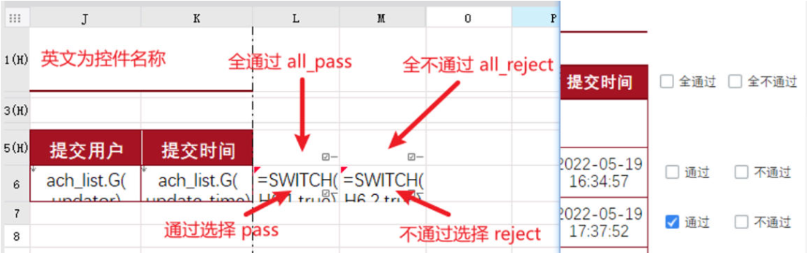
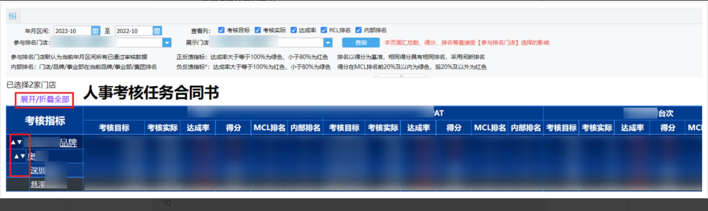

# FR-延迟后刷新

```javascript
setTimeout(function() {
  //事件内容
	location.reload();
}, 2000);
```

# FR-父窗口填报

```javascript
window.parent.contentPane.verifyAndWriteReport(true);
```

# FR-递归将逻辑转换为由原子指标构成

关于指标定义

| 类型   | 编码 | 指标逻辑 |
| ---- | -- | ---- |
| 基础指标 |  item1_1  |   item1_1   |
| 基础指标 |  item1_2  |   item1_2   |
| 计算指标 |  item1_3  |   item1_1 * item1_2 +1  |

```javascript
FR.i18n['Fine-Engine_Report_Successfully'] = "更新完成！";
function replace(itemList, calList, repStr, pattern) {
    // itemList 所有科目编号，数组
    // calList itemList所对应科目的引用计算逻辑
    // repStr 需要进行递归查找由基础指标组成的公式
    // pattern 科目名称的正则匹配模式
    // return repStr由基础指标组成的公式
    
    var matches = repStr.matchAll(pattern);
    var newStr = repStr;
    var offset = 0;
    for (var match of matches) {
        var itemMatch = match[0];
        var index = match.index;
        var newItem = calList[itemList.indexOf(itemMatch)];
        if (newItem != itemMatch) {
            newStr = newStr.substring(0, index + offset) + "(" + newItem + ")" + newStr.substring(index + offset + itemMatch.length);
            offset += newItem.length - itemMatch.length + 2;
        }
    }
    if (repStr == newStr) {
        return newStr;
    } else {
        return replace(itemList, calList, newStr, pattern);
    }
}
// 匹配模式 item1_{数字}，如item1_2
var pattern = /item1_\\d+/g;

// 基础指标base非空，来源于FR引入的参数，由“指标编号#指标逻辑”组成，如item1#item1_1，item1#item1_2+item1_3
if (base.length != 0) {
    // 基础指标
    var baseItem = [];
    var baseCal = [];
    for (var i = 0; i < base.length; i++) {
        baseItem[i] = base[i].split("#")[0];
        baseCal[i] = base[i].split("#")[1];
    }
    // 运营表
    var operArrLen = operList.length;
    if (operArrLen != 0) {
        var operItem = [];
        var operCal = [];
        for (var i = 0; i < operArrLen; i++) {
            operItem[i] = operList[i].split("#")[0];
            operCal[i] = operList[i].split("#")[1];
        }
        var operNewCal = [];
        for (var i = 0; i < operArrLen; i++) {
            operNewCal[i] = replace(baseItem, baseCal, operCal[i], pattern);
            // 4 表明在设计器模板中下移4行
            _g().setCellValue(0, 0, i + 4, operItem[i]);
            _g().setCellValue(0, 1, i + 4, operNewCal[i]);
        }
    }
}
```

# FR-结合复选框做单选&全选

<!--  -->


## 初始化

```javascript
setTimeout(function() {
	var isAllChecked = true;
    //全不选的空间只需将”pass“替换为“reject”
	var boxes = _g().getWidgetsByName("pass");
	//获取当前页的复选按钮控件数组
	if (typeof(boxes[0]) != "undefined") {
		//如果控件大于1个，则遍历获取值，一旦出现未选中状态的按钮，则将标记值改为false
		for (i = 0; i < boxes.length; i++) {
			isAllChecked = boxes[i].getValue() == true ? isAllChecked : false;
		}
	} else {
		//如果控件只有1个，则直接获取控件值，并传给标记值
		isAllChecked = boxes.getValue();
	}
	//将标记值赋给当前类型全选按钮单元格
	var cr = FR.cellStr2ColumnRow(_g().getWidgetsByName("all_pass").options.location);
	//获取行列号对象
	_g().setCellValue(0, cr.col, cr.row, isAllChecked);
}, 100);
```

## 全选按钮（all\_pass\&all\_reject）状态改变事件

```javascript
// 当前全选按钮控件值
var flag = this.getValue();
// 标记全（不）选的偏移，1表示在当前全选按钮的右边一个单元格，,这里是全选控件，全不选控件在右边
var offset = 1;
var allCheckCell = FR.cellStr2ColumnRow(this.options.location);
// 联动另一全选控件
if (flag && _g().getCellValue(0, allCheckCell.col + offset, allCheckCell.row)) {
    _g().setCellValue(0, allCheckCell.col + offset, allCheckCell.row, !flag);
}
// 审核通过数组控件
var pass = _g().getWidgetsByName("pass");
// 审核不通过数组控件
var reject = _g().getWidgetsByName("reject");
// 当前状态改变是哪个类型控件，这里是【通过】即pass，若编辑的是【审核不通过】按钮，则为reject
var boxes = pass;
if (typeof (boxes[0]) != "undefined") {
    //如果控件大于1个，则遍历赋值
    for (i = 0; i < boxes.length; i++) {
        //获取行列号对象
        var cr = FR.cellStr2ColumnRow(boxes[i].options.location);
        _g().setCellValue(0, cr.col, cr.row, flag);
        // 若选择通过且原来审核为不通过则【审核不通过】按钮进行反向赋值
        if (_g().getCellValue(0, cr.col + offset, cr.row)) {
            _g().setCellValue(0, cr.col + offset, cr.row, !flag);
        }
    }
} else {
    //如果控件只有1个，则直接赋值
    //获取行列号对象
    var cr = FR.cellStr2ColumnRow(boxes.options.location);
    _g().setCellValue(0, cr.col, cr.row, flag);
    // 互斥全选为选中，编辑后取消选中
    if (_g().getCellValue(0, cr.col + offset, cr.row)) {
        _g().setCellValue(0, cr.col + offset, cr.row, !flag);
    }
}
```

## 单行按钮（pass\&reject）状态改变事件

```javascript
// 处理不通过标记控件
//设置标记状态为选中
var isAllChecked = true;
// 标记全（不）选的偏移，1表示在当前全选按钮的右边一个单元格,这里是全不选控件，全选控件在左边
var offset = -1;
//获取当前页的复选按钮控件数组，若列是【通过】按钮列，则reject替换为pass，反之，pass替换为reject
//全选按钮的替换类似，只是名称不同
var boxes = _g().getWidgetsByName("reject");
if (typeof (boxes[0]) != "undefined") {
    //如果控件大于1个，则遍历获取值，一旦出现未选中状态的按钮，则将标记值改为false
    for (i = 0; i < boxes.length; i++) {
        isAllChecked = boxes[i].getValue() == true ? isAllChecked : false;
    }
} else {
    //如果控件只有1个，则直接获取控件值，并传给标记值
    isAllChecked = boxes.getValue();
}
//将标记值赋给当前类型全选按钮单元格
var cr = FR.cellStr2ColumnRow(_g().getWidgetsByName("all_reject").options.location);
//获取行列号对象
_g().setCellValue(0, cr.col, cr.row, isAllChecked);
// 同时互斥的全选标记取消全选
_g().setCellValue(0, cr.col + offset, cr.row, false);
//同一版数据通过与不通过不能两者互斥
if (this.getValue()) {
    cell = FR.cellStr2ColumnRow(this.options.location);
    if (_g().getCellValue(0, cell.col + offset, cell.row)) {
        _g().setCellValue(0, cell.col + offset, cell.row, false);
    }
}
```


# FR-通过table属性制作进度条

```html
<table style='background:#043856;border-radius:6px;border-left-width:0px;' 
				width=100% height=3px cellspacing=0 cellpadding=5>
	<tr>
		<!-- x>=0时绘制第一个td，否则第一个td为空即可 -->
		<!-- x<=1时绘制第二个td，否则第二个td为空即可 -->
		<!-- 上述实际针对的是x无数据的情况 -->
		<td style='background: linear-gradient(to right, #45c45e, #17e641);border-radius: 8px;' 
				width=' + x * 100 + '%'>
		</td> 
		<td style='background: linear-gradient(to right, #043856, #043856);border-radius: 8px;' 
				width=' + (1-x) * 100 + '%'>
		</td>
  </tr>
</table>
```

# FR-通过display属性实现折叠树

```javascript
// js+display属性实现报表折叠树（针对耗时长报表或数据分析模式无法实现，条件属性实现每次查询很久）
// 限制：报表为行式报表，报表中不不存在固定冻结列
// 节点点击执行展开/折叠
// 被点击单元格所在列索引，0开始,使用报表函数col()需要减1
// var col = 0;
// 获取单元格当前值，即节点关系编号，自定义但有一定规则以便能用js获取子节点等
// var cur_node = "1s";
// 单元格值需要为字符，不可为纯数字，如123不行，即使单元格格式是文本
var selector = "td[col='" + col + "'][cv^='\"" + cur_node + "_']";
console.log(selector);
// 获取当前节点以及下属节点html标签数组
var nodeList = document.querySelectorAll(selector);
console.log(nodeList.length);
if (nodeList.length != 0) {
    // 根据第一行判断执行展开/折叠
    var flag = nodeList[0].parentElement.style.display == "" ? "none" : "";
    // 设置是否隐藏行
    for (i = 0; i < nodeList.length; i++) {
        var style = nodeList[i].parentElement.style.display = flag;
    }
}
// 全部展开/折叠按钮
var cur_node1 = "b\"";
var cur_node2 = "u\"";
var selector = "td[col='" + col + "'][cv$='" + cur_node1 + "'],td[col='" + col + "'][cv$='" + cur_node2 + "']";
console.log(selector);
// 获取当前节点以及下属节点html标签数组
var nodeList = document.querySelectorAll(selector);
console.log(nodeList.length);
if (nodeList.length != 0) {
    // 根据第一行判断执行展开/折叠
    var flag = nodeList[0].parentElement.style.display == "" ? "none" : "";
    // 设置是否隐藏行
    for (i = 0; i < nodeList.length; i++) {
        var style = nodeList[i].parentElement.style.display = flag;
    }
}
```

# FR-编辑后强制弹窗并提交

```javascript
setTimeout(function () {
    $('.close_mouseout').hide();
}, 200);
// 弹窗目标报表
var report_address = "/webroot/decision/view/report?viewlet=DCH/04hr/data_provided/绩效考核调整事项_填报.cpt&op=write";

// 需要传递的值
var adjust_val = this.getValue();
var ym = _g().getParameterContainer().getWidgetByName("dateStart").getValue();
var adjust_type = "qbr";
var adjust_name = "QBR"
// 存在值
if (adjust_val) {
    FR.Msg.alert("提示", "即将前往调整事项说明填报\\n若为误操作可关闭或刷新本标签页！", function (value) {
        if (value == true) {
            // 弹窗定义
            FR.doHyperlinkByPost({
                //报表路径
                "url": report_address,
                //参数
                "para": {
                    "adjust_val": adjust_val,
                    "ym": ym,
                    "units_code": units_code,
                    "ach_id": ach_id,
                    "adjust_type": adjust_type,
                    "adjust_name": adjust_name,
                    "subject_code": subject_code,
                    "subject_name": subject_name
                },
                "target": "_dialog", //对话框方式打开
                "feature": {
                    "width": 800,
                    "height": 500,
                    "isCenter": true, //是否居中显示
                    "title": "调整【" + subject_name + "】" + ym + adjust_name + "数说明",
                    "closeable": false
                }
            })
        }
        setTimeout(function () {
            $('.fr-core-panel-tool-close').hide();
        }, 200);
    })
}
```

# FR-弹窗时二次确认

```javascript
FR.Msg.alert("提示", "设置为默认密码前将自动提交当前页面，是否确认？", function (value) {
    if (value == true) {
        //校验并提交当前页面
        _g().verifyAndWriteReport();
        // 弹窗目标报表
        var report_address = "/webroot/decision/view/report?viewlet=DCH/01basic/bi_emp_org/用户账号重置密码.cpt&op=write";
        FR.doHyperlinkByPost({
            //报表路径
            "url": report_address,
            //参数
            "para": {
                "username": username,
                "realname": realname
            },
            "target": "_dialog", //对话框方式打开
            "feature": {
                "width": 400,
                "height": 300,
                "isCenter": true, //是否居中显示
                "title": "设置默认密码",
                "closeable": true
            }
        });
    }
})
```

# FR-鼠标悬浮行变色

使用场景：报表行与行之间不存在合并单元格，一行中的单元格的背景颜色都是一样的，不同的行背景颜色可以不一样

模板添加加载结束事件:

```javascript
setTimeout(function () {
    // 全局变量：背景色
    window.bg_orgin = undefined;
    // 表头所在的最大行号
    var tb_head_row = 8;
    // 悬浮时的背景色
    var bg_select = '#EEEEEE';
    // 鼠标移入事件
    $(".x-table td").mouseover(function () {
        // 获取当前元素的style标签
        var tag_style = $(this).attr("style");
        // style标签是否存在
        if (tag_style == undefined) {
        } else {
            // 获取当前元素的background-color对应的值，没有返回null
            var matched = tag_style.replace(/\\s/ig, "").match(/background-color:(.*?);/i)
            var backgroundColor = (matched == null) ? null : matched[1];
        }
        // 背景色并赋值给全局变量
        window.bg_orgin = backgroundColor == null ? window.bg_orgin : backgroundColor;
        // 获取当前鼠标所在单元格的html的id标签值
        var tag_id = $(this).attr("id");
        //截取id值中的行号
        var row = tag_id.substr(0, tag_id.search("-")).replace(/[^0-9]+/ig, "");
        // 设置背景色，标题行不变色
        row <= tb_head_row ? null : $(this).parent('tr').find("td").css('background-color', bg_select);
        console.log("移入背景："+window.bg_orgin);
    });
    // 鼠标移出事件
    $(".x-table td").mouseout(function () {
        if (window.bg_orgin == undefined) {
            // window.bg_orgin未定义，获取当前单元格背景
            // 获取当前元素的style标签
            var tag_style = $(this).attr("style");
            // style标签是否存在
            if (tag_style == undefined) {
            } else {
                // 获取当前元素的background-color对应的值，没有返回null
                var matched = tag_style.replace(/\\s/ig, "").match(/background-color:(.*?);/i)
                var backgroundColor = (matched == null) ? null : matched[1];
            }
            // 背景色并赋值给全局变量
            window.bg_orgin = backgroundColor == null ? window.bg_orgin : backgroundColor;
        }
        var tag_id = $(this).attr("id");
        //截取id值中的行号
        var row = tag_id.substr(0, tag_id.search("-")).replace(/[^0-9]+/ig, "");
        // 设置背景色，标题行不变色
        row <= tb_head_row ? null : $(this).parent('tr').find("td").css('background-color', window.bg_orgin);
        console.log("移出背景："+window.bg_orgin);
        // 重置全局变量值
        window.bg_orgin = 'transparent';
    });
}, 50);
```