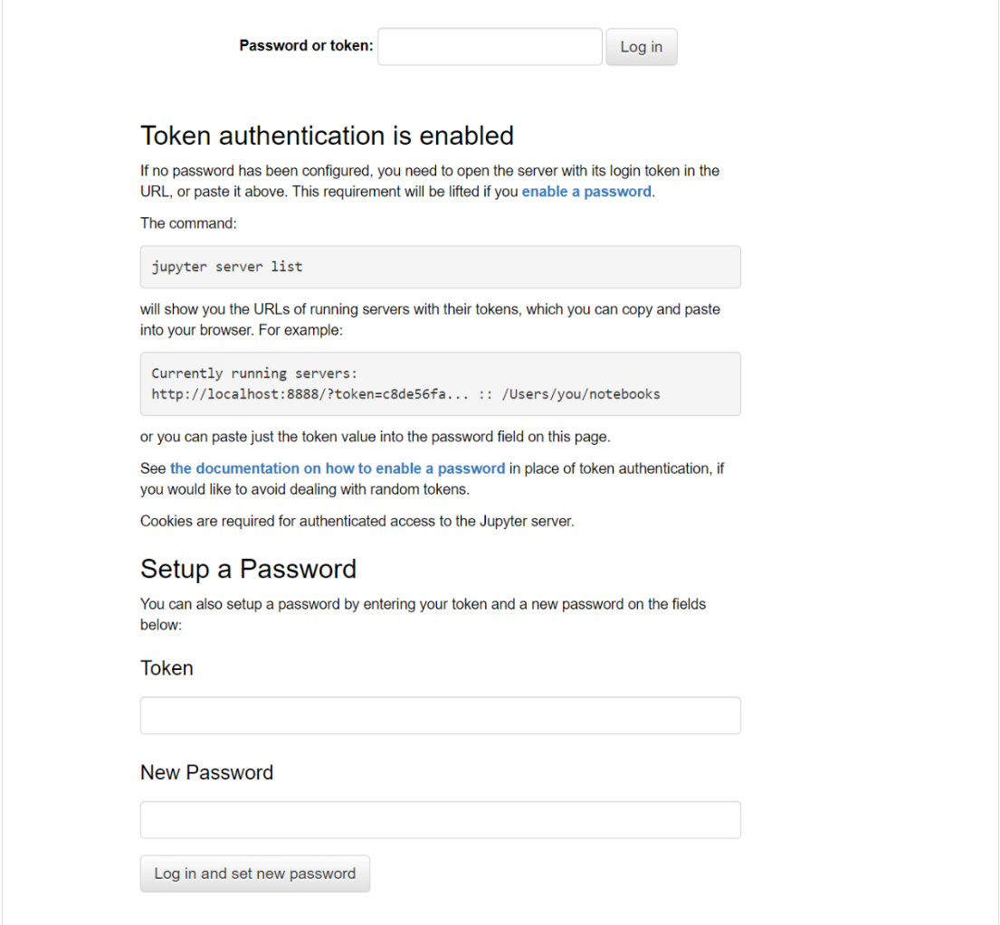
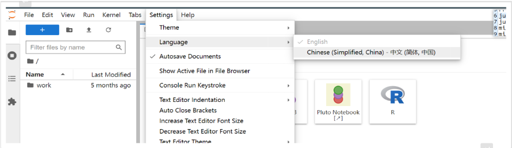

# Docker 部署

## 安装(不挂载数据卷)

```bash
sudo docker stop jupyterlab
sudo docker rm jupyterlab

sudo docker run -d \
--restart unless-stopped \
--name jupyterlab \
-p 33088:8888 \
jupyter/datascience-notebook:2023-10-20
```

登录并初始化系统数据，设置密码，根据提示操作完成



## 拷贝卷到宿主机

```bash
sudo docker cp jupyterlab:/home/jovyan /home/xpcheng/docker-data/jupyterlab/
```

## 挂载卷重建容器

```bash
sudo docker stop jupyterlab
sudo docker rm jupyterlab

sudo docker run -d \
--restart unless-stopped \
--name jupyterlab \
-p 33088:8888 \
-v /home/xpcheng/docker-data/jupyterlab/jovyan:/home/jovyan \
jupyter/datascience-notebook:2023-10-20
```

# 插件安装

参见 [JupyterLab 插件](main/JupyterLab-plugin.md)

# 设置中文界面

## 进入容器(非 docker 部署跳过)

```bash
docker exec -it jupyterlab bash
```

## 安装中文包

```bash
pip install jupyterlab-language-pack-zh-CN
```

## 前端刷新，设置中文



# FAQ

##　 PermissionError: \[Errno 13] Permission denied: '/home/jovyan/.local/share/jupyter/runtime/jpserver-7-open.html'

挂载目录的权限问题，修改用户组`chown xxx:xxx -R dir`

## jupyterlab 日志 Uncaught exception GET /terminals/websocket/1

nginx 代理 ws 问题，可参见：https://github.com/jupyter/notebook/issues/2664#issuecomment-346249652

```bash
upstream notebook {
        server localhost:8888;
}
server {
        listen 80;
        server_name xxx.xxxx.com;
        rewrite ^/(.*) https://xxx.xxxx.com/$1 permanent;
}
server{
        listen 443 ssl;
        index index.html index.htm index.php default.html default.htm default.php;
        server_name xxx.xxxx.com;
        root /home/wwwroot/xxx.xxxx.com;
        ssl_certificate /etc/letsencrypt/live/xxx.xxxx.com/fullchain.pem;
        ssl_certificate_key /etc/letsencrypt/live/xxx.xxxx.com/privkey.pem;
        ssl_ciphers "EECDH+CHACHA20:EECDH+CHACHA20-draft:EECDH+AES128:RSA+AES128:EECDH+AES256:RSA+AES256:EECDH+3DES:RSA+3DES:!MD5";
        ssl_protocols TLSv1 TLSv1.1 TLSv1.2;
        ssl_prefer_server_ciphers on;
        ssl_session_cache shared:SSL:10m;

        location / {
                proxy_pass            http://notebook;
                proxy_set_header      Host $host;
        }

        location ~ /api/kernels/ {
                proxy_pass            http://notebook;
                proxy_set_header      Host $host;

                proxy_http_version    1.1;  # websocket support
                proxy_set_header      Upgrade "websocket";
                proxy_set_header      Connection "Upgrade";
                proxy_read_timeout    86400;
        }
        location ~ /terminals/ {
                proxy_pass            http://notebook;
                proxy_set_header      Host $host;

                proxy_http_version    1.1;  # websocket support
                proxy_set_header      Upgrade "websocket";
                proxy_set_header      Connection "Upgrade";
                proxy_read_timeout    86400;
        }
}
```

## 忘记密码修改密码

```bash
# 打开cmd，进入ipython交互环境
ipython
```

```python
# python环境下输入
from jupyter_server.auth import passwd; passwd()
# 在这里输入想要设置的登录JupyterLab 的密码 然后会有一串输出，复制下来，等会配置需要使用
'argon2:$argon2id$v=19$m=10240,t=10,p=8$oRZRKSbeS1VF8qKhRElb9w$sPiWQ00efLX4aU1ZhovbzPfaDK+3wp2/WtmypYNq58g'
```

修改 JupyterLab 配置文件，一般在`/home/jovyan/.jupyter/jupyter_server_config.json`

```json
{
  "IdentityProvider": {
    "hashed_password": "argon2:$argon2id$v=19$m=10240,t=10,p=8$oRZRKSbeS1VF8qKhRElb9w$sPiWQ00efLX4aU1ZhovbzPfaDK+3wp2/WtmypYNq58g"
  }
}
```

重启容器

```bash
docker restart jupyterlab
```
