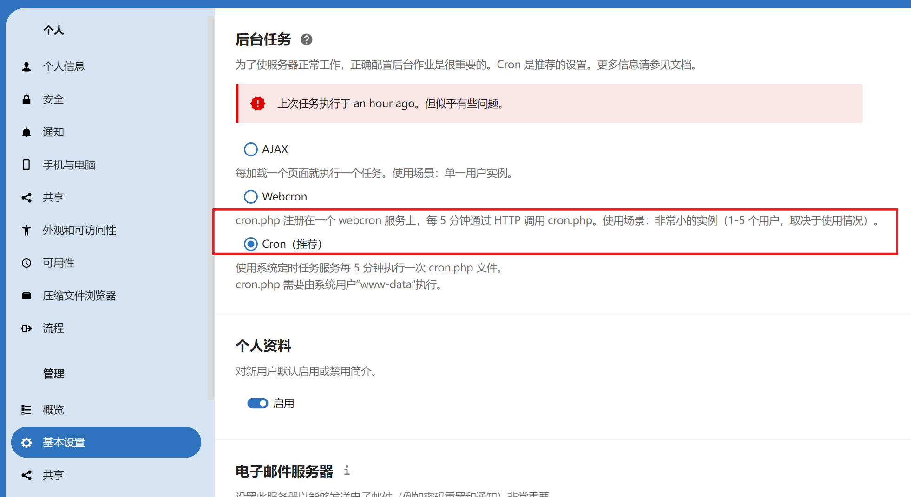

本示例部署依赖:

1. MySQL，[MySQL 配置与操作](main/MySQL配置与操作.md)
2. Redis，[Redis](main/Redis.md)

# Docker

采用 Docker 部署，需要修改 MySQL、redis 对应的配置

一般配置文件位于 `/var/www/html/config/config.php`，不然就官网看看帮助文档

## 运行容器

```bash
docker stop nextcloud
docker rm nextcloud

docker run -d \
--restart unless-stopped \
--name nextcloud \
--link mysql8:mysql8 \
--link redis:redis \
--link onlyoffice:onlyoffice \
-p 46460:80 \
-v /share/Container/nextcloud/data:/var/www/html \
-v /share/Container/nextcloud/php_config:/usr/local/etc/php \
-e TZ=Asia/Shanghai \
nextcloud:stable
```

# 示例配置文件一览

[nextcloud 官方示例配置](main/nextcloud_config_example_gf.md) 或点击访问 [Github config.sample.php](https://github.com/nextcloud/server/blob/master/config/config.sample.php)

基于官方说明自己调整的 [nextcloud 示例配置](main/nextcloud_config_example_my.md)

# 后台定时任务配置

Nextcloud 部署完后需要通过 cron（官方建议）或其他工具来做后台任务，频率建议是每 5 分钟执行一次


cron 时执行命令为 `php -f /var/www/html/cron.php`

由于部署在 Docker 上，命令需要调整为 `docker exec --user www-data nextcloud php -f /var/www/html/cron.php`

同时我的 Nextcloud 部署在威联通 QTS 系统上，不能用常规的 cron 去编辑配置，正确操作可参见 [威联通 cron 定时任务](main/QNAP?id=%e5%a8%81%e8%81%94%e9%80%9a-cron-%e5%ae%9a%e6%97%b6%e4%bb%bb%e5%8a%a1)

# 更新文件索引

当文件手动移动或增减，可以通过后台重建索引实现文件更新

```bash
docker exec -it nextcloud bash
cd /var/www/html
chown root:root config/config.php
php occ files:scan --all
chown www-data:www-data config/config.php
root@076e0466ade7:/var/www/html# php occ files:scan --all
Starting scan for user 1 out of 1 (<user_name>)
+---------+-------+--------------+
| Folders | Files | Elapsed time |
+---------+-------+--------------+
| 223 | 394 | 00:00:20 |
+---------+-------+--------------+
Console has to be executed with the user that owns the file config/config.php
Current user: root
Owner of config.php: www-data
Try adding 'sudo -u www-data ' to the beginning of the command (without the single quotes)
 --
之所以要改一次用户和组，因为config/config.php原用户权限是www-data，docker下默认用户是root，且内缺失大量用户权限相关的命令，如sudo 只好临时用root执行。
后续发现更好的办法 直接以www-data 进容器，避免权限问题
docker exec -it --user www-data nextcloud bash
```

# Nextcloud 优化

https://blog.lincloud.pro/archives/48.html

## 优化图片或视频缩略图加载缓慢或者无法显示的问题

**默认情况下，动图或者视频格式的文件无法生成缩略图，或者生成缓慢，需要安装 FFmpeg 来解决问题**

如果是使用容器安装 nextcloud 可以使用以下命令来进入容器，注意修改容器名

```bash
docker exec -it nextcloud /bin/sh

apt update
# 执行安装 FFmpeg
apk add ffmpeg
# 或
apt install ffmpeg
```

安装成功后需要修改 nextcloud 配置文件 `config.php` 文件配置，添加以下行数

```bash
  'enable_previews' => true,
  'enabledPreviewProviders' =>
  array (
    0 => 'OC\\Preview\\PNG',
    1 => 'OC\\Preview\\JPEG',
    2 => 'OC\\Preview\\GIF',
    3 => 'OC\\Preview\\HEIC',
    4 => 'OC\\Preview\\BMP',
    5 => 'OC\\Preview\\XBitmap',
    6 => 'OC\\Preview\\MP3',
    7 => 'OC\\Preview\\TXT',
    8 => 'OC\\Preview\\MarkDown',
    9 => 'OC\\Preview\\Movie',
   10 => 'OC\\Preview\\MKV',
   11 => 'OC\\Preview\\MP4',
   12 => 'OC\\Preview\\AVI',
   13 => 'OC\\Preview\\Photoshop',
   14 => 'OC\\Preview\\TIFF',
   15 => 'OC\\Preview\\SVG',
  ),
```

重启 Nextcloud 服务解决缩略图问题

## 优化 php-fpm 性能，提高页面加载效率

优化 `www.conf` 配置文件，增加更多的进程来处理页面数据。

如果是使用容器安装 nextcloud 可以使用以下命令来进入容器，注意修改容器名

```bash
docker exec -it nextcloud /bin/sh
# 查找 www.conf 位置，一般在/usr/local/etc/php-fpm.d/www.conf
find / -name www.conf
```

但 `docker` 部署的实际好像在 `/usr/local/etc/php/conf.d# cat nextcloud.ini`

需要修改和添加的字段有：

```bash
# pm.max_children = 5
pm.max_children = 128

# pm.start_servers = 2
pm.start_servers = 14

#pm.min_spare_servers = 1
pm.min_spare_servers = 4

# pm.max_spare_servers = 3
pm.max_spare_servers = 24

# 添加以下字段
request_terminate_timeout = 300
```

数值越大，进程越多，平均每个进程消耗 32M-96M 内存，按需设置

设置成功后重启 nextcloud 服务即可。

## 解除块大小限制，提升传输速度

在有良好的传输网络下，比如局域网，应当解除块大小限制来提升网络传输效率，默认是 102400（10M），设置为 0 即可关闭块大小限制

```bash
# 如果是使用容器安装nextcloud可以使用以下命令来进入容器，注意修改容器名
docker exec --user www-data nextcloud php occ config:app:set files max_chunk_size --value 0

# 如果使用本机环境运行的可以使用这条语句
sudo -u www-data php occ config:app:set files max_chunk_size --value 0
```
