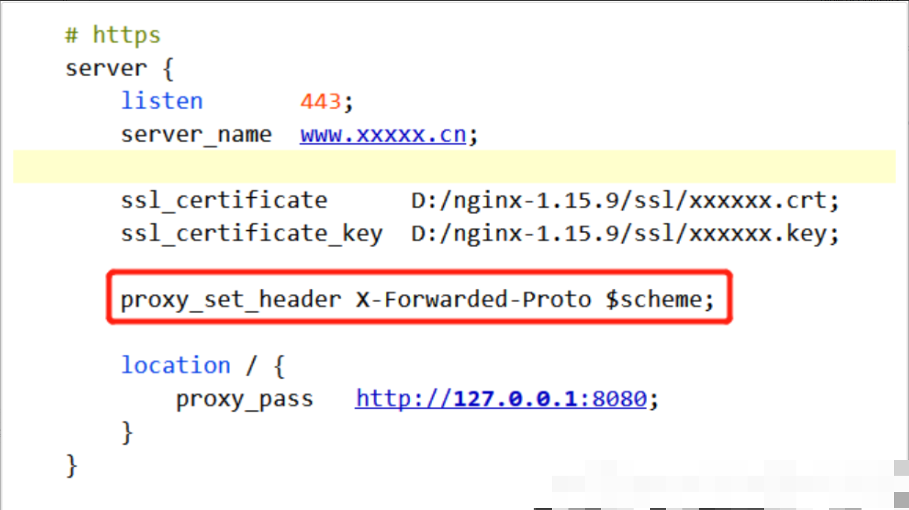
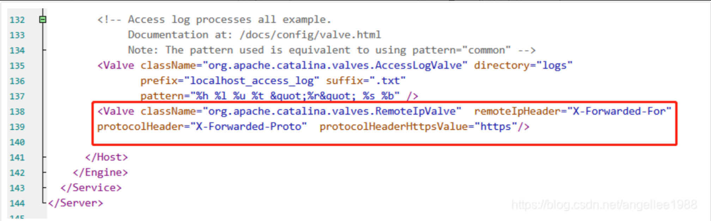
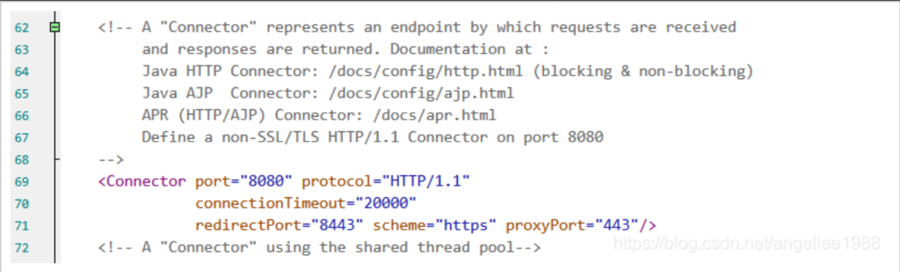

# nginx.service

systemd 可参见: [systemd 安装与使用](main/systemd_install_and_service_exmaple.md)

## 创建服务文件

```bash
[Unit]
# 服务名称，可自定义
Description = nginx server
After = network.target syslog.target
Wants = network.target

[Service]
Type = forking
# 启动nginx的命令
ExecStart = /usr/local/nginx/sbin/nginx -c /opt/program/nginx/conf/nginx.conf
ExecStop = /usr/local/nginx/sbin/nginx -c /opt/program/nginx/conf/nginx.conf -s quit
ExecReload = /usr/local/nginx/sbin/nginx -c /opt/program/nginx/conf/nginx.conf -s reload

[Install]
WantedBy = multi-user.target
```

重加载服务

```bash
systemctl daemon-reload
```

## 查看结果

```bash
[root@ECSNode ~]# sudo systemctl start nginx.service
[root@ECSNode ~]# sudo systemctl status nginx.service
● nginx.service - nginx server
   Loaded: loaded (/etc/systemd/system/nginx.service; disabled; vendor preset: enabled)
   Active: active (running) since Mon 2024-03-18 13:21:59 CST; 5s ago
  Process: 1116085 ExecStart=/usr/local/nginx/sbin/nginx (code=exited, status=0/SUCCESS)
 Main PID: 1116086 (nginx)
    Tasks: 2 (limit: 5611)
   Memory: 2.3M
   CGroup: /system.slice/nginx.service
           ├─1116086 nginx: master process /usr/local/nginx/sbin/nginx
           └─1116087 nginx: worker process

Mar 18 13:21:59 ECSNode systemd[1]: Starting nginx server...
Mar 18 13:21:59 ECSNode systemd[1]: Started nginx server.
[root@ECSNode ~]# sudo systemctl enable nginx.service
Created symlink /etc/systemd/system/multi-user.target.wants/nginx.service → /etc/systemd/system/nginx.service.
[root@ECSNode ~]# sudo systemctl status nginx.service
● nginx.service - nginx server
   Loaded: loaded (/etc/systemd/system/nginx.service; enabled; vendor preset: enabled)
   Active: active (running) since Mon 2024-03-18 13:21:59 CST; 23s ago
 Main PID: 1116086 (nginx)
    Tasks: 2 (limit: 5611)
   Memory: 2.3M
   CGroup: /system.slice/nginx.service
           ├─1116086 nginx: master process /usr/local/nginx/sbin/nginx
           └─1116087 nginx: worker process

Mar 18 13:21:59 ECSNode systemd[1]: Starting nginx server...
Mar 18 13:21:59 ECSNode systemd[1]: Started nginx server.
[root@ECSNode ~]#
```

# Nginx Location 语法

[Nginx Location Module](main/Nginx_Location_Module.md)

# FAQ

## Nginx 代理 https 到 Tomcat，后端获取不到 https 链接

使用 Nginx 代理 https 到 Tomcat，后端 request.getRequestURL()获取不到 https 开头的链接

在网站改为 https 后，后台 tomcat 实际访问的地址为 http，在某些场景下会有问题。

### 解决方法：

#### Step1：nginx 的 location 块中增加配置

```ini
proxy_set_header X-Forwarded-Proto  $scheme; 
```



#### Step2：修改 Tomcat server.xml 配置，有两种方案修改 Tomcat 配置

- 方案一：在 Tomcat server.xml 的 Engine 模块下配置一个 Valve

```xml
<Valve className="org.apache.catalina.valves.RemoteIpValve"  remoteIpHeader="X-Forwarded-For"  protocolHeader="X-Forwarded-Proto"  protocolHeaderHttpsValue="https"/>  
```



- 方案二：Connector 新增 scheme="https" proxyPort="443"

```xml
<Connector port="8080" protocol="HTTP/1.1" connectionTimeout="20000" redirectPort="8443" scheme="https" proxyPort="443"/>
```



#### 重启 Tomcat

重启 tomcat 即可
